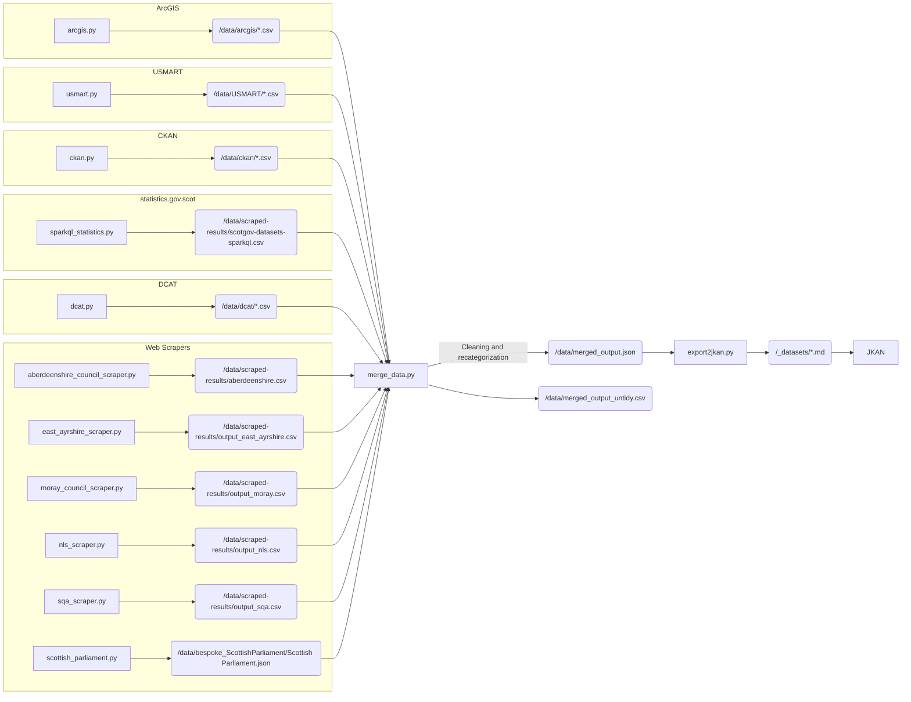

```mermaid
graph LR
    subgraph ArcGIS
    arcgis1[arcgis.py] --> arcgis2(/data/arcgis/*.csv)
    end
    subgraph USMART
    usmart1[usmart.py] --> usmart2(/data/USMART/*.csv)
    end
    subgraph CKAN
    ckan1[ckan.py] --> ckan2(/data/ckan/*.csv)
    end
    subgraph statistics.gov.scot
    stats1[sparkql_statistics.py] --> stats2(/data/scraped-results/scotgov-datasets-sparkql.csv)
    end
    subgraph DCAT
    dcat1[dcat.py] --> dcat2(/data/dcat/*.csv)
    end
    subgraph Web Scrapers
    abdn1[aberdeenshire_council_scraper.py] --> abdn2(/data/scraped-results/aberdeenshire.csv)
    ea1[east_ayrshire_scraper.py] --> ea2(/data/scraped-results/output_east_ayrshire.csv)
    moray1[moray_council_scraper.py] --> moray2(/data/scraped-results/output_moray.csv)
    nls1[nls_scraper.py] --> nls2(/data/scraped-results/output_nls.csv)
    sqa1[sqa_scraper.py] --> sqa2(/data/scraped-results/output_sqa.csv)
    sparl1[scottish_parliament.py] --> sparl2(/data/bespoke_ScottishParliament/Scottish Parliament.json)
    end
    arcgis2 --> merge
    usmart2 --> merge
    ckan2 --> merge
    stats2 --> merge
    dcat2 --> merge
    abdn2 --> merge
    ea2 --> merge
    moray2 --> merge
    nls2 --> merge
    sqa2 --> merge
    sparl2 --> merge
    merge[merge_data.py] --Cleaning and recategorization--> merge1(/data/merged_output.json)
    merge --> merge2(/data/merged_output_untidy.csv)
    merge1 --> export[export2jkan.py]
    export --> jkan1(/_datasets/*.md)
    jkan1 --> jkan2[JKAN]
```

